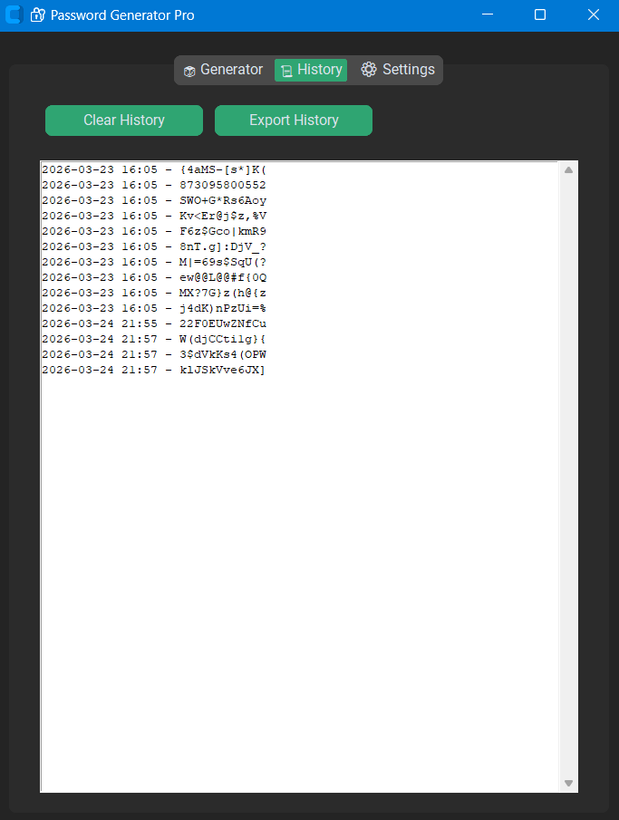

🔐 Password Generator
A secure and modern password generator built with Python and CustomTkinter. Features real-time strength meter, dark mode, and one-click copy to clipboard.
## 📸 Screenshots

| Feature | Preview |
|---------|---------|
| Password Generator |  |
| History |  |

✨ Features
- ✅ Password length slider (4-32 characters)
- ✅ Character type options (uppercase, lowercase, numbers, symbols)
- ✅ Real-time strength meter with color coding
- ✅ One-click copy to clipboard
- ✅ Dark/Light mode toggle
- ✅ Password history (last 5 passwords)
- ✅ Clean modern GUI

 🛠️ Tech Stack
- Python 3.9+
- CustomTkinter
- Pyperclip
- JSON (for history storage)

---

## 🌅 My Philosophy
> ### *"Har din ek naya savera hai"*
> One step at a time — building practical skills and learning how to protect digital environments effectively, without taking unnecessary pressure. ✨

---

## ✍️ About the Developer

### **Harish Nirmalkar**  
🎓 **MCA Student** • *Rungta International Skills University*  

💬 **Let's grow together!** I am always open to collaborations, learning discussions, or sharing tech ideas.  

🤝 **Network with me:**  
👉 [**Visit My LinkedIn Profile** 🌐](https://linkedin.com/in/harish-nirmalkar-b23776394)
